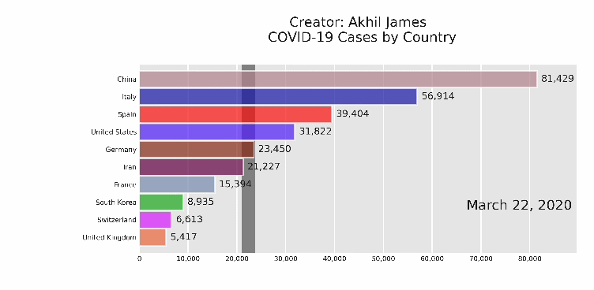

# Bar Chart Race - COVID19
Creating a Bar Chart Race for the total number of COVID19 cases reported.

## Website used for fetching data
https://ourworldindata.org/coronavirus-data

## Workflow
1. Download the data from the website as an xlsx file.
2. Arrange the data as a pandas data frame in the required format for the library bar_chart_race in python.
3. Use bar_chart_race to generate the mp4 video and save it.

## Tools used
Python 3 
pandas 
numpy 
bar_chart_race 
